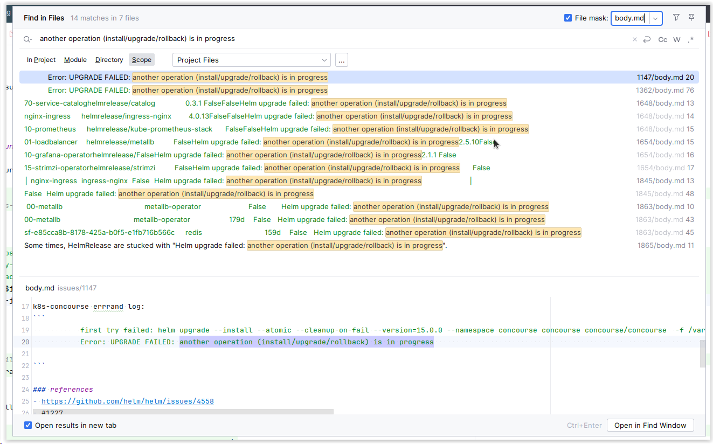

# issue-mirroring
Sample project to experiment with mirroring gh issues as files in the repo 

## getting stated

* download github cli locally, see https://github.com/cli/cli?tab=readme-ov-file#documentation
* run [download-issues.bash](./download-issues.bash) to download/refresh gh issues locally, which results into:
   >   issues
   >   ├── 1
   >   │   ├── body.md
   >   │   └── meta.yaml
   >   ├── 10
   >   │   ├── body.md
   >   │   ├── comments.md
   >   │   └── meta.yaml
* search the issue local files using your preferred tools such as
   * intellij IDEA text search (CTRL+ALT+SHIFT+E) and filter type file name. More in [#searching-workflows](#searching-workflows)
      * meta.yml for searching in title
      * body.md for searching in the issue body
      * comments.md for search in the issue comments

See sample usage 

## motivations

* search issues with ide
* search prs with ide
* exec issues workaround code snippets
* edit issues with ide
* edit pr body with ide


## Issues scope
* [x] Gh issues
* [ ] Gitlab issues
* [ ] Gh pr
* [ ] Gitlab pr

* [ ] Submit Intellij RFE indexing & full-text search of GH and gitlab issues & PRs

## [x] Mirror gh issues as files

How:
* [x] Local script manual exec
* [ ] Gh action calling script calling gh cli
* [ ] cron 

## [ ] git commit mirror files in repo

Why ?
* Use as a cache (for mirroring process)
* Facility for history: Git log
* Username mirroring gh issue author/modif
* Publish as gh pages to control seo
* Gitguardian/Git leak action detect leaks (in issues/comments)

## Format suiteable for searching
* Fs layout: dirs files
* Files: meta-data, issue content, issue comments
* Rdms: sqllite

## Issue File content: json/yaml produced from cli

## file format
* Yaml for meta-data
  * [x] initial poc using jq
     * [ ] tune format to get systematic string quotes around title
  * [x] nice text search formatting in intellij search everywhere 
  * [ ] format/collapse labels
* [x] Markdown for body and comments
   * Potential benefit of hyperlink to body file 
* [ ] ~~Csv~~
* [ ] Rdms: sqllite ?
* [ ] Code: js, ts, bash

### [ ] use of code to format content/metadata 

Code potentials
* Leverage IDE native code support
* Leverage native sdk to interact with api

Relevant IDE code support features:
* Code navigation
* Code completion
* Code call hierarchy
* Code exec: run, run as test
* Vendor Native gh/gitlab sdk
* Code dependency analysis
* Code structure navigation
* Code quick outlook
* Code structure (navigation and simple search)
* Code quick doc
* Code doc Markdown rendering

Code dependency analysis use cases;
* Issue clustering: as tree
* Cyclonatic complexity

Issue clustering use cases:
* Discover group of Related issues
* Automate applying missing labels to clusters


Code navigation use cases:
* Issue/pr relationships: closes/ relates
* Issue/issue relationship: xref

Code completion use cases:
* Author query by meta-data ( fluent api)

Code exec use cases:
* Trigger search: response in terminal / run logs

Code call hierarchy use cases:
* Browse relationship graph

Code doc use cases;
* Issue content
* Issue meta-data

Code structure options:
* Static: meta-data structure (reflects gh api=native sdk)
* Almost static: repo labels
* Dynamic: issue meta-data, issue content

## [x] Fs layout

options
* [x] Custom: issue id / comments =
* [ ] Native Gh rest api structure
* [ ] Some key metadata: status, 

Main tree:
issues/${number}/meta.yaml, body.md, comments.md

```
issues/
├── 1
│   ├── body.md
│   └── meta.yaml
├── 10
│   ├── body.md
│   └── meta.yaml
├── 100
│   ├── body.md
│   └── meta.yaml
```

### [ ] FS layout substree with metadata symlinks

Try to add symlink to ease searching by specific critera

issues-with-metadata/by-title/${title}/${number}  (symlink-to: issues/${number})
issues-with-metadata/by-status/${status}/${number} (symlink-to: issues/${number})
issues-with-metadata/by-label/${label1}/${number}  (symlink-to: issues/${number})
issues-with-metadata/by-label/${label2}/${number}  (symlink-to: issues/${number})
issues-with-metadata/by-author/${author}/${number}  (symlink-to: issues/${number})
issues-with-metadata/by-assignee/${assignee}/${number}  (symlink-to: issues/${number})

automation ideas:
* metadata json to bash variable + use in shell
* cli output template produces shell commands to execute 

## Searching workflows

* By multiple criteria (open/closed, labels, authors, milestones)
  * Using regexps in IDE
     * [x] (?s) to have . match new lines, see https://youtrack.jetbrains.com/issue/IDEA-69435/Search-for-Multi-line-fragment#focus=Comments-27-6381293.0-0 
     * e.g. `(?s)OPEN.* cilium` 
* By full text search:
  * Search in files
     * with file masks:
        * meta.yaml
        * body.md
  * Search text (C+S+A+E)

Current UX Pbs in IDE-based full-text search: 
* [ ] Missing title in search result in body.md
    * [ ] change body.md to body.yaml with title and body
        * [] yq support for string litterals
    * [ ] append title to body.md         
      * [ ] append title to body.md after download
      * [ ] remove title to body.md before upload
* [ ] Missing sorting order (date asc/desc)
* [ ] Missing filtering (open/closed)

## Searching ux priorities:
* Responsiveness
* Precision
* Criteria completion/history
* Enable execute script snipet workflow
* Enable edit issue workflow

## Searching ux options:
* Cli
* Ide search
  * Not yet yaml structural search in intellij 
     * [x] submit RFE: https://youtrack.jetbrains.com/issue/IDEA-344736/Structural-search-add-Json-Yaml-language

## Criteria searching options
* IDE full-text search
* IDE code search
* IDE code navigation
* Script (grep/find/jq/yq)

## Full-text search options:
* Intellij natural langage search
* Script

## Edit workflow 
* [ ] Edit body
  * [x] manually call [upload-edited-issues.bash](upload-edited-issues.bash)
  * [ ] Git watch + gh cli issue update
* [ ] Edit metadata
* [ ] Edit comments


## prior art

How to search for prior art:
* Gh cli repo: issues prs, who is using
* Gh gh discussions
* Google
* Gh sdks
* Awesome gh 

https://github.com/matomo-org/github-issues-mirror (archived, php)
> All issues are stored as JSON on the file system in src/data:
> * There is one JSON file for each issue in src/data/issues. To not end up having too many files in one directory they are split into subdirectories from 1 to 100. Otherwise the file names are equal to the issue number: 1875.json = Issue 1875.
> * There is one JSON file for each page in src/data/pages. 1.json === Page 1, 2.json === Page 2, ..

https://github.com/IQAndreas/github-issues-import
> This Python script allows you to import issues and pull requests from one repository to another